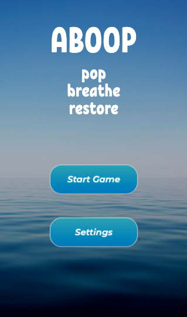
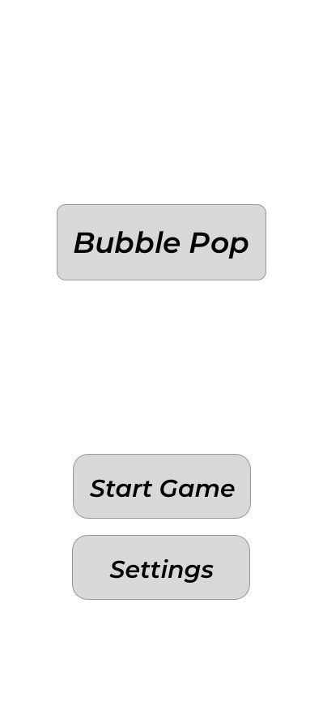
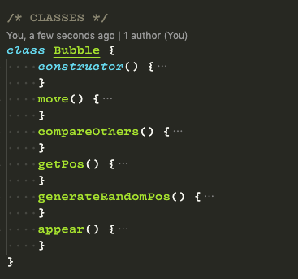
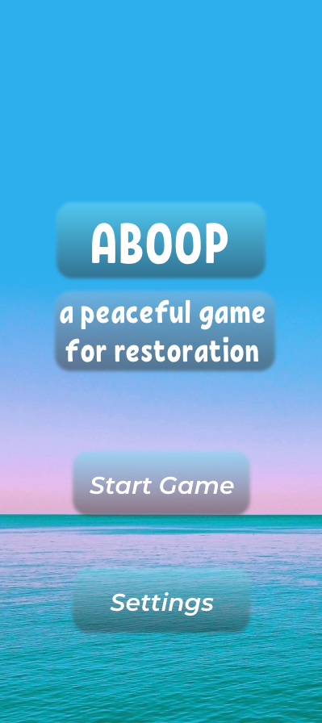
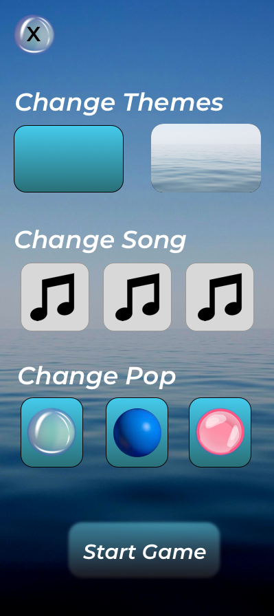
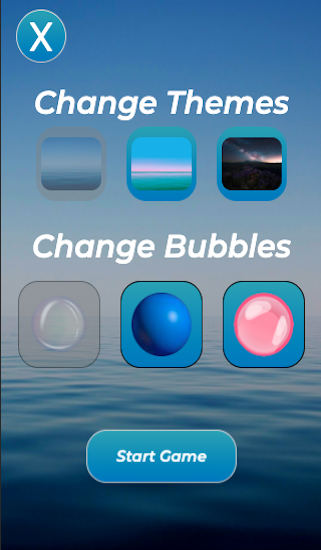
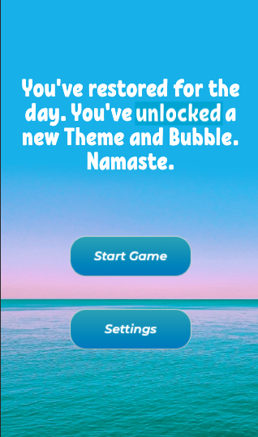
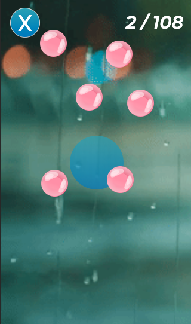

# Project 0 
## Jacob Kleiman 🦄
### SEI 08

<hr>

Title: Aboop<br>
Type: Project<br>
Creator: Jacob Kleiman<br>
Goal: Relax the user and gamify the restorative process
<hr>



<hr>


## Planning
Over the intial days of the project, I worked on low to mid-fidelity wireframes, this process was one of the first things I did to ensure a feasible implementation and concept of design.

<hr>



<hr>

## The basic idea

Upon starting the game, the user's screen will begin to slowly populate with bubbles. During this time, a larger bubble (The Guru bubble, if you will) will guide the player into retaining their breath while popping 108 bubbles (a sacred number in Hindu, Buddhist, and yogic traditions).


## The Bubbles

Here is the  ```Bubble``` class in my js file. The bubble class is responsible for housing the bubble positions on the screen, as well as their width, animation, collision detection, and their popping functionality. Bubbles move at a rate of 5 pixels per 100 miliseconds!

<hr>



<hr>

## The Collision Detection

For each frame in the game, each bubble scans for:
* Every other bubble on the screen: if a bubble collides with another bubble, it will change its direction (velocity) in the opposite x or y direction, this depends on where the bubbles hit each other. 
* Colliding with the edges of the screen. The program attaches a resize event listener onto the body, so everytime the screen is resized, the bubbles will take into account the locations of the edges.
  * Also: the size of the screen is proportional to the number of bubbles that will pop into the game. Users with larger screens will experience more bubbles than mobile users.

## The UI and Branding

The branding concept behind the game was something of a result of two main ideas, Playful and Natural

<hr>


<hr>

I went ahead with my newfound sense of direction and began crafting higher fidelity wireframes. I love using Sketch and Adobe Xd... so this process was utterly fun and a way to allow me to utilize my creative process on a project that had started off so logically complex.

<hr>





<hr>

## The Deliverable

After the first inital days of back-end development and wireframing and planning. I committed my final two days to implementing as much of the front-end as I could. And I'm proud to announce I've never been happier with a project that entails front-end development. Some of my major acheivements was creating the breathe element (the bubble guru) as well as the bubble animations, theme and bubble customization, and how this project can really go many ways from here.

<hr>







<hr>

Thanks for the read!